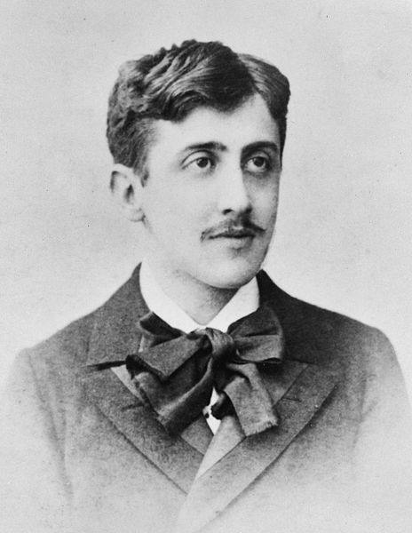

# funathon2023_sujet6

## A la recherche de l'alimentation perdue

## Objectif : Rechercher les aliments consommés dans l’œuvre de Proust

    Source : A la recherche du temps perdu

    Mise en pratique :
    - NLP
    - recherche d'entités nommées (NER)
    - la lecture de documents écrits par Marcel
    
    
## Bibliographie :
